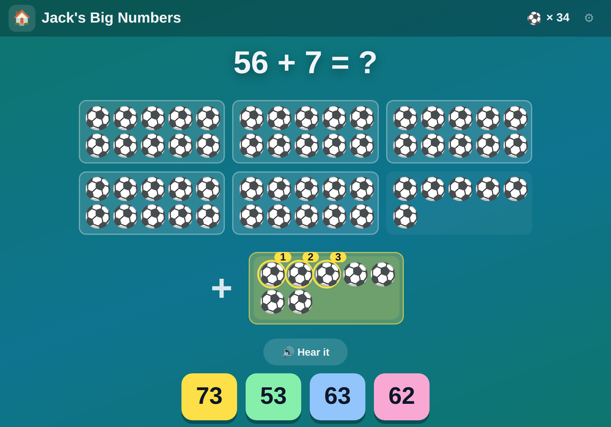

# 💯 Jack's Big Numbers

**Two-digit maths all the way to one hundred — tens, ones, and nets full of footballs**

[](https://jacks-games.github.io/big-numbers/)




## What this is

[Jack's Numbers](https://github.com/jacks-games/numbers) stops at twenty. This is the
sequel for the child who has outgrown it: sixty sums with two-digit numbers, in six steps
that follow the order Year 1 is taught in.

|   | Step | Example |
|---|---|---|
| 1️⃣ | **Tens and ones** — read a number off the nets | 🥅🥅🥅 ⚽⚽⚽⚽ → 34 |
| 2️⃣ | **Add ones, no bridging** — the tens never move | 23 + 4 |
| 3️⃣ | **A whole ten more, a whole ten gone** | 45 + 10, 47 − 10 |
| 4️⃣ | **Bridging** — the ones spill into the next ten | 27 + 5, 32 − 4 |
| 5️⃣ | **Whole tens** | 30 + 40, 100 − 40 |
| 6️⃣ | **What comes next** — counting on in 2s, 5s and 10s | 35, 40, 45, ? |

The picture is always footballs, and always **ten to a net**. Seventy-five is seven nets and
five loose balls, not a heap of seventy-five — the same tens rods they use at school. Taking
away crosses the balls out where they stand, and taking away ten crosses out one whole net,
so the number of nets is what changes.

## 🎮 How to play

### 1️⃣ &nbsp; Look at the nets 🥅
Count the nets in tens, then the loose ones. Every ball can be tapped and says its own
number out loud — "twenty-one, twenty-two, twenty-three" — so counting on is always
available when the sum is hard.

### 2️⃣ &nbsp; Pick the number 🔢
Four tiles, one right. The three wrong ones are the mistakes a six-year-old actually makes:
**one out**, **ten out**, or **the two digits the other way round** (27 for 72). A wrong tap
wobbles the tile, greys it out and costs nothing — there is no way to lose.

### ⚽ &nbsp; Goal!
The right tile pays a football, shows the whole sum with the answer in rainbow letters, and
reads it back: *"Twenty-seven! Twenty-three plus four is twenty-seven."* Five right in a row
gets **On fire! 🔥**.

### 🏁 &nbsp; Full time
After the sixtieth sum the full-time whistle goes, the football tally is shown, and
**Play again** starts the whole thing over. The place in the list and the tally are kept on
the device, so it can be picked up at the next sum tomorrow.

## 🎯 What it practises

- 🔟 &nbsp; **Place value** — seeing 75 as *seven tens and five*, which is the whole point of the nets
- ➕ &nbsp; **Adding and subtracting to 100** — with and without crossing a ten
- 🔁 &nbsp; **Counting on** in twos, fives and tens from any starting number
- 👂 &nbsp; **Hearing the number words** — every number from *zero* to *one hundred* is spoken, including the awkward ones (*forty*, not "fourty"; *ninety-nine*)

## 🗣 The voice

Every line is a **pre-rendered clip** of Microsoft's neural `en-GB-SoniaNeural` voice — 254 of
them: each question, each answer, each full sentence, and every number word to a hundred. The
browser's own speech synthesis is only the fallback for a line with no clip, because on an
iPhone it sounds like a robot and a six-year-old notices.

Everything the game can say is built in one block of `index.html` marked `TEXT-CORE`, and the
phrase list the clips are rendered from is generated straight out of that block — so a new sum
can never end up with no voice.

## 🎈 The other games

| Game | What it is | |
|---|---|---|
| 🔟 [**Jack's Ten Frames**](https://github.com/jacks-games/ten-frames) | See numbers in fives, make ten, then add past ten on ten frames | [▶ play](https://jacks-games.github.io/ten-frames/) |
| ⏰ [**Jack's Clock**](https://github.com/jacks-games/clock) | Read the clock and set the hands — o'clock, half past, quarter past, quarter to | [▶ play](https://jacks-games.github.io/clock/) |
| 💯 [**Jack's Big Numbers**](https://github.com/jacks-games/big-numbers) | Tens and ones, adding and taking away all the way to 100 | [▶ play](https://jacks-games.github.io/big-numbers/)  👈 **this one** |
| 👀 [**Jack's Sight Words**](https://github.com/jacks-games/sight-words) | The twenty most common English words on big cards — tap one and hear it read out | [▶ play](https://jacks-games.github.io/sight-words/) |
| 🍎 [**Jack's Apples**](https://github.com/jacks-games/apples) | Trace 1–20, then fill the missing numbers into the apple grid | [▶ play](https://jacks-games.github.io/apples/) |
| 🥅 [**Jack's Match**](https://github.com/jacks-games/match) | Tell real words from decodable nonsense words, then spell by ear | [▶ play](https://jacks-games.github.io/match/) |
| ✏️ [**Jack's Letters**](https://github.com/jacks-games/letters) | Finger-trace all 26 lowercase letters in the correct stroke order | [▶ play](https://jacks-games.github.io/letters/) |
| 🔢 [**Jack's Numbers**](https://github.com/jacks-games/numbers) | Count, add and subtract with footballs — to 10, then to 20 | [▶ play](https://jacks-games.github.io/numbers/) |
| 📖 [**Jack's Words**](https://github.com/jacks-games/words) | Hear a word, build it from letter tiles, then read it in a sentence | [▶ play](https://jacks-games.github.io/words/) |
| ♟️ [**Jackies Schach**](https://github.com/jacks-games/chess) | Full FIDE rules with a coach that marks the safe squares (German) | [▶ play](https://jacks-games.github.io/chess/) |

All ten on one start page: **[jackbenn.ing](https://jackbenn.ing)** — newest first, homework on top, chess always last.

## 🛠 Built like this

Every game in this organisation is **one self-contained `index.html`** — no build step, no
framework, no package manager, no analytics, and no network calls beyond its own voice clips (chess also loads its rules engine, chess.js, from
jsDelivr, and Sight Words its font from Google Fonts).
That is a deliberate constraint: a game a child depends on should still work in five years,
and a parent should be able to read the whole thing in one sitting.

- **Speech** — pre-rendered clips of the neural `en-GB-SoniaNeural` voice, played through Web Audio,
  with the Web Speech API as the fallback. The `AudioContext` is created inside the ▶ tap,
  because iOS refuses to start audio any other way.
- **Progress** — kept in `localStorage` on the device (`jackBigIndex`, `jackBigFootballs`).
  Nothing is collected, sent or stored anywhere else.
- **Made for** an iPad mini in either orientation and a phone: the footballs shrink until the
  whole sum fits the screen, so the tiles are never pushed out of reach and the page never
  scrolls. Finger-sized targets, no hover-only interactions, `prefers-reduced-motion`
  respected.

Run it locally:

```bash
python3 -m http.server 8000
```

The start page at [jackbenn.ing](https://jackbenn.ing) is built from
[google814/Jack](https://github.com/google814/Jack), which is the source of truth. The repos
in this organisation are copies kept in step by `tools/sync-game-repos.sh` in that repo, so
each game also has its own page and its own link.
